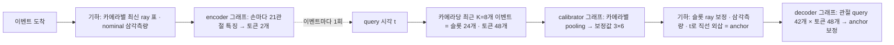

# 두 손 3D 포즈 Transformer

생성된 관측으로 **현재 예측 시각의 두 손 42개 관절 XYZ**를 복원하는 초기 모델입니다. 구현·실행 검증을 마쳤으며, `runs/hand_transformer_smoke`의 가중치는 짧은 동작 확인용입니다. 본학습 성능으로 해석하지 마세요.

## 모델 구조 (시간 기준 이벤트 입력)

```mermaid
flowchart LR
  E[도착한 카메라 프레임 = 이벤트<br/>카메라 ID · 촬영/도착 시각(초) · 42관절 ray] --> V[이벤트별 보정 근거<br/>nominal ray vs 카메라별 최신 ray 삼각측량]
  V --> K[학습형 보정: 직전 0.5초 근거만 pooling → 카메라 간 비교 → 이벤트별 보정값]
  K --> S[이벤트별 보정 삼각측량 표본 + 이벤트 토큰<br/>관절 42개 spatial encoder]
  S -. 여기까지 이벤트마다 1회 계산·캐시 .-> Q[query 시각 t]
  Q --> A[t까지 도착한 표본에 직선 맞춤 → t로 외삽한 anchor]
  Q --> D[관절 query 42개 → 같은 관절의 이벤트 토큰 cross-attention<br/>t − 촬영 시각 bias → 관절 간 spatial attention × 3]
  A --> D
  D --> H[anchor + 보정값 = t 시각 XYZ]
```

기본 폭 96, head 4, decoder 2블록, 이벤트 encoder 1층, dropout 0.1, **763,693 파라미터**입니다. 라즈베리 파이 실시간 추론을 위해 이전 크기(폭 128·3블록, 1,746,765개)에서 줄였습니다. 정확도 영향은 학습으로 비교해야 합니다(`--dim 128 --blocks 3`). 이전(프레임 기준) 구조의 체크포인트는 로드할 수 없습니다. 이번 모듈 분리 전의 **이벤트 모델 체크포인트는 그대로 로드**할 수 있습니다.

### 코드 구성

`hand_transformer.py`와 `hand_dataset.py`는 기존 스크립트용 호환 모듈이며 공개 이름만 다시 내보냅니다. 새 코드는 `hand_tracking.*`에서 직접 import하세요. 구현은 `hand_tracking/` 아래에 있으며, 모듈 분리로 신경망 계층 이름이나 가중치 형태를 바꾸지 않았습니다.

| 파일 | 역할 |
|---|---|
| `constants.py` | 카메라·손·관절 수, 특징 채널 위치(`RAY_ORIGIN` 등), 시간 단위, 공통 허용 오차 |
| `config.py` | 모델 기본값·검증·필드별 설명, 필드에서 생성하는 학습 CLI, 입력 슬롯 수 `SamplingConfig` |
| `contracts.py` | 이벤트 필드·인코딩 결과·레이어별 K/V·윈도 샘플(`WindowSample`)·입력/정답 키·텐서 축 변환 |
| `geometry.py` | 삼각측량, 회전, Gauss–Newton 보정, 선택적 motion fit (학습 파라미터 없음) |
| `events.py` | 이벤트 수락 정책, 최신 ray 선택, 표본과 query anchor, 상대 시각 변환, 모델 없는 anchor 기준선 |
| `model.py` | attention(학습된 null key 포함)과 `HandTransformer`; 배치·스트림 공통 `encode_events()`·`decode_queries()` |
| `stream.py` | 이벤트 버퍼, float64 절대 시각 캐시, 증분 인코딩과 query |
| `objectives.py` | pose·calibration loss, MPJPE/PCK 누적(`PoseTotals`)과 가중 평균 |
| `engine.py` | 학습·검증 공통 epoch 실행(`run_epoch`), 모델 없는 anchor 평가(`evaluate_anchor`) |
| `checkpoints.py` | 가중치·입력 설정 저장·복원, 학습 재개 상태(`training_checkpoint`/`restore_training`) |
| `data.py` | manifest·NPZ 읽기, 이벤트 복원, 윈도 샘플링과 rig 증강 |
| `export.py` | HandTransformer ONNX 내보내기(`export_onnx`)와 ONNX Runtime 비교(`compare_onnx`) |
| `lite.py` | HandLite 모델(고정 크기 신경망 3개 + 기하)과 `LiteStream` |
| `lite_export.py` | HandLite 신경망 3개를 ONNX·ncnn(pnnx)으로 내보내기 |
| `lite_runtime.py` | PyTorch 없는 배포 런타임: numpy 기하 + ncnn 또는 ONNX Runtime |

실행 스크립트(`train_…`, `evaluate_…`, `predict_hand_transformer.py`, `export_onnx.py`, `export_lite.py`)는 인자 해석과 위 모듈 호출만 합니다. 테스트는 모듈별 파일(`tests/test_geometry.py`, `test_events.py`, `test_data.py`, `test_model.py`, `test_stream.py`, `test_training.py`, `test_scripts.py`, `test_onnx_export.py`, `test_lite.py`)이며 공통 합성 입력은 `tests/model_helpers.py`에 있습니다. `python -m unittest discover -s tests`로 실행합니다. ONNX 테스트는 `requirements-export.txt`가 없으면 건너뜁니다.

ONNX 내보내기를 위해 모델 경로에서 ONNX 연산자가 없는 연산을 뺐습니다: 3×3 `linalg.solve` → 닫힌 형식(`solve3`), `linalg.cross` → `cross3`, `cummax` 기반 이벤트 수락 → 쌍별 비교, SDPA → 명시적 attention. `rodrigues`는 sqrt 안의 epsilon 대신 영점 근처 Taylor 전개를 씁니다(내보내기에서 epsilon이 사라져 NaN이 났음). 가중치 구조는 같아 기존 체크포인트를 그대로 로드하며, 출력 차이는 최대 약 1e-5 월드 단위(≈0.003mm)입니다.

카메라별 촬영 시각이 이전 최대값 이하인 프레임은 배치와 스트림 모두 무시합니다. 배치는 슬롯을 제거하지 않고 `present`를 꺼서 인덱스와 padding을 유지합니다. 빈 검출 프레임은 새로운 촬영이면 정상 수락합니다. 스트림은 이미 수락된 버퍼를 query마다 재필터링하지 않습니다. 인코딩 실패 시 pending 이벤트를 남겨 재시도할 수 있습니다.

학습 체크포인트에 `sampling_config.max_events`를 함께 저장하며 평가·예측에서 복원합니다. 이전 체크포인트는 `training_options.max_events`, 해당 정보도 없으면 기본 128을 사용합니다. 평가의 `--max-events`는 명시적 덮어쓰기입니다. `context_s`는 모델 설정에서 계산합니다. Colab 생성기는 패키지 전체를 포함하고 소스 사본의 하위 폴더도 보존합니다.

구조 변경 검증: 테스트 72개 통과(HandLite 포함). 모듈 분리 때는 변경 전 소스와 출력·gradient 차이가 0이었고, ONNX 대응 수정 후에는 연산 방식 변경으로 최대 약 1e-5 월드 단위 차이가 납니다. 실제 NPZ 2클립으로 학습·재개·평가·예측·ONNX 내보내기 CLI를 실행했고, 학습 지표는 리팩터링 전과 같았습니다(train 46.16mm / val 106.31mm, 개발용 1 epoch). 이는 구조·실행 검증이며 본학습 정확도나 실제 Colab GPU/Pi 측정이 아닙니다.

**모든 범위가 초 단위**이고 입력은 실제로 도착한 카메라 프레임입니다. 그래서 query 빈도(출력 fps)에 묶이지 않고, 같은 관측이 여러 query에 반복되는 토큰도 없습니다. 카메라마다 자기 촬영·도착 시각을 그대로 가집니다.

1. **이벤트**: 카메라 프레임 1개(카메라 1대가 본 42관절 ray)가 도착 순서대로 들어옵니다. 기존 query 격자 export에서 `selected_frame`으로 복원합니다. 프레임이 처음 선택된 query에서 읽으며, **관절이 하나도 검출되지 않은 프레임도 이벤트**입니다. 실시간처럼 그 카메라의 이전 ray를 밀어내기 때문입니다. 시뮬레이터가 기록한 선택 목록과 일치하는지 테스트로 확인합니다.
   - **순서 규칙:** 인과 관계는 **입력 순서(도착 순)**로 정합니다. 이벤트는 자기보다 앞선 이벤트만 봅니다. 도착 시각이 같은 이벤트도 넣은 순서대로 처리되어 batch와 stream 결과가 같습니다.
   - **최신 ray 선택:** 카메라별 "최신" ray는 도착이 아니라 **촬영 시각**이 가장 늦은 것입니다. 늦게 도착한 옛 촬영이 최신 관측을 덮어쓰지 않습니다. `EventStream.push()`는 같은 카메라의 더 새 촬영 뒤에 도착한 옛 촬영을 버리고 `False`를 돌려줍니다. 시뮬레이터도 이런 프레임은 선택하지 않습니다. 두 query 사이에 같은 카메라가 두 번 도착해 앞 프레임이 한 번도 쓰이지 않은 경우는 이 export 형식으로 복원할 수 없습니다. 초당 약 51개(카메라 3대 × 17.1fps)입니다.
2. **보정 근거**(이벤트마다, 보정과 무관): 그 이벤트가 도착한 시점에 카메라별 최신 ray(촬영 후 `sample_max_age_s`=0.2초 이내)를 nominal로 삼각측량합니다. 이벤트 자신의 ray가 그 점에서 얼마나 벗어나는지를 관절 토큰으로 만들고, 이벤트 단위로 평균해 근거 요약 1개를 만듭니다. **게이트를 쓰지 않습니다.** 어긋남 자체가 보정 근거이기 때문입니다.
3. **학습형 카메라 보정**(`calibration_head`): 이벤트마다 직전 `calibration_span_s`(0.5초) 안에 도착한 이벤트의 근거만 카메라별로 attention pooling합니다. 카메라 3개를 비교해 보정값(회전 3·위치 3)을 냅니다. 장기 기억은 없습니다. 근거(다른 카메라와 함께 본 ray)가 없는 카메라는 nominal(0)입니다. 출력층은 0으로 초기화됩니다. 관측 가능한 것은 카메라 사이의 **상대 오차**뿐입니다.
4. **보정 표본과 이벤트 토큰**: 이벤트의 보정값으로 카메라별 최신 ray를 보정해 삼각측량 표본을 만듭니다. 표본의 시각은 사용한 ray들의 평균 촬영 시각입니다. 이벤트 토큰은 관절별로 u,v·보정된 ray·지연·표본까지의 수직 벡터·보정값을 담고, 42관절 spatial encoder를 거칩니다. 절대 시각은 넣지 않습니다.
5. **query 시각의 anchor**: query 시각 t까지 **도착한** 이벤트의 표본만 씁니다. 최근 `anchor_lookback_s`(0.2초)의 서로 다른 표본에 직선을 맞춰 t로 외삽합니다(최대 0.25초). 안 되면 `anchor_hold_s`(0.3초) 이내의 최신 표본을 유지하고, 그다음은 같은 손 평균, 원점 순서입니다.
6. **decoder**: 관절 query 42개(관절 임베딩 + anchor·flag)가 **같은 관절의** 이벤트 토큰에 cross-attention합니다. 대상은 t까지 도착하고 촬영 후 `event_span_s`(0.4초) 이내인 이벤트입니다. attention에는 (t − 촬영 시각)으로 만든 head별 bias를 더합니다. 이어서 관절 42개끼리 spatial attention을 거칩니다. 3블록 뒤 anchor에 더할 XYZ 보정값을 냅니다. 출력층은 0으로 초기화됩니다. cross-attention은 행렬곱·softmax로 직접 구현했습니다(`TransformerEncoderLayer` fast path의 3D mask NaN 회피, ONNX 내보내기 호환).
7. **옵션**(기본 끔): `anchor_motion_fit`은 이벤트 ray에 `p + v·t`를 직접 맞춥니다. `anchor_ray_gate`는 잔차가 큰 표본을 제외합니다. 시뮬레이션 검증셋에서 둘 다 anchor 오차를 키워서 기본으로 끕니다. 아래 수치를 참고하세요.

| 입력 | 형태 / 의미 |
|---|---|
| event_features | `[B,E,2,21,14]` 이벤트별 관절 u,v · ray 원점/방향 · (export 기준 시각) · 촬영→도착 지연 · ID |
| event_valid / event_present | `[B,E,2,21]` 관절 관측 여부 / `[B,E]` 실제 이벤트 여부(False = padding) |
| event_camera | `[B,E]` 0–2 |
| event_capture / event_arrival | `[B,E]` 초. 도착 순서로 정렬. query와 같은 기준점이면 기준점은 무관 |
| query_times | `[B,Q]` 초. 각 query는 그 시각까지 도착한 이벤트만 씀 |
| 출력 | pose `[B,Q,2,21,3]`. `return_details=True`면 `ModelOutput(pose, calibration [B,E,3,6], accepted [B,E])`: 이벤트별 보정값과 실제로 사용한(수락된) 이벤트 |
| 단위 | 현재 데이터 1월드=30cm; 예측값 ×300 = mm |

학습 window는 GT가 있는 query 시각 16개와 이벤트로 이루어집니다. 이벤트는 첫 query보다 `config.context_s`(기본 1.35초) 전부터 마지막 query까지 도착한 것이고, 최대 128개(보통 약 92개)입니다. 이 구간이면 모든 query가 스트리밍 때와 같은 입력을 받습니다. 카메라는 3대로 고정입니다. 손 순서는 원본 데이터 순서를 따릅니다. 실측/실제 카메라 파라미터(`actual_*`), physical timestamp, 정답은 모델 입력에 넣지 않습니다.

### 스트리밍 추론

```python
stream = EventStream(model)
stream.push(camera, features, valid, capture_time, arrival_time)   # 카메라 프레임이 도착할 때마다(저장만)
pose = stream.query(time)                                          # 원하는 시각마다(최신 도착 이후)
```

- 이벤트마다 보정 근거, 보정값, 표본, 이벤트 토큰, **decoder 층별 key/value**를 한 번만 계산해 캐시합니다. `push()`는 저장만 하고, 다음 `query()`(또는 `flush()`) 때 그사이 도착한 이벤트를 한 번에 계산합니다. 각 이벤트의 계산은 먼저 도착한 이벤트에만 의존하므로 결과는 같고 호출 오버헤드만 줄어듭니다. query는 anchor와 decoder만 계산합니다.
- 결과는 같은 이벤트로 계산한 `forward()`와 같습니다. query 시각이 격자 위든 사이든 같습니다(테스트로 확인).
- 입력 버퍼는 복사해 보관합니다. 이벤트는 도착 순서로 넣어야 합니다.
- 연산량: 이벤트당 약 16 MFLOP, query당 약 18 MFLOP입니다(key/value 캐시 전 query는 846 MFLOP).
- PC 측정(i7-1260P, 카메라 속도와 같은 17Hz query, 새 이벤트 약 3개 포함): query 1회 9–11ms, 스트림 1초당 약 0.16–0.19초입니다. 1스레드와 4스레드의 차이가 거의 없습니다. 연산보다 파이썬·PyTorch 호출 오버헤드가 대부분이라는 뜻입니다.
- 라즈베리 파이는 측정 전입니다. 오버헤드가 대부분이라 CPU 단일 코어 성능에 비례한다고 보면, Pi 5는 query 1회 약 30–55ms(17Hz에서 1초당 0.5–0.95초)로 한계선입니다. Pi 4는 그보다 약 2배 느려 17Hz 실시간이 어렵습니다. 반드시 실제 장치에서 측정하세요.
- 장기 상태가 없어 카메라가 움직여도 약 0.5초 뒤에는 새 배치 기준으로 보정됩니다. 스트림이 끊겼다면 `reset()`하세요.

## HandLite (배포용 경량 모델)

`--arch lite`로 학습하는 두 번째 구조입니다. 라즈베리 파이에서 ncnn으로 돌리기 위해 신경망을 **고정 크기의 작은 그래프 3개**로 나누고, 기하 계산은 신경망 밖(numpy/C++)에 둡니다.



| | HandTransformer | HandLite |
|---|---|---|
| 파라미터 | 763,693 | 191,469 (폭 64) |
| 이벤트 입력 | 윈도 전체(최대 128슬롯), 이벤트당 관절 토큰 42개 | 카메라당 최근 8개, 이벤트당 손 토큰 2개 |
| 보정 | 이벤트마다 추정 후 이벤트별 재삼각측량 | query마다 슬롯에서 1회 추정 |
| query당 신경망 연산 | 약 18 MFLOP(스트림) / 846 MFLOP(forward) | 약 13 MFLOP(calibrator 1.1 + decoder 11.8, pnnx 집계) + 이벤트당 encoder 0.1 |
| 배포 | PyTorch 스트림, ONNX forward(ncnn 불가) | ncnn·ONNX 그래프 + numpy 런타임 |

- **배치와 스트림이 같습니다**: `forward()`, `LiteStream`(PyTorch), `LiteRuntime`(numpy + ncnn/ONNX Runtime)이 같은 값을 냅니다. 개발 체크포인트·실제 클립 30개 query에서 PyTorch 대비 ONNX Runtime 1.8e-6, ncnn 9.9e-6 월드 단위였습니다. 무작위 가중치 시험에서 ncnn은 최대 약 4e-4(≈0.1mm)였습니다(fp16/GELU 근사).
- **슬롯**: query 시각까지 도착하고 촬영이 `event_span_s`(0.5초) 이내인 이벤트 중 카메라별 최근 `slots_per_camera`(8)개입니다. 17fps에서 약 0.47초입니다. 슬롯 순서는 도착 순서이고 빈 슬롯은 앞에 둡니다.
- **anchor**는 HandTransformer와 같은 규칙(표본 직선 외삽, 유지, 손 평균)을 슬롯 표본에 적용합니다. 보정값은 query마다 모든 슬롯 ray에 같게 적용합니다.
- 신경망은 Linear·LayerNorm·GELU·MatMul·Softmax와 더하기 마스크(−1e4)만 씁니다. 4차원 이하 텐서만 써서 ncnn 제약을 지킵니다.

**학습·내보내기·장치 실행**

```powershell
.\.venv-transformer\Scripts\python.exe train_hand_transformer.py --arch lite --data exports/gigahands_balanced_5gb --output runs/hand_lite --device cpu
.\.venv-transformer\Scripts\python.exe export_lite.py --checkpoint runs/hand_lite/best.pt --output runs/hand_lite/deploy --check-input exports/gigahands_balanced_5gb/val/clip_00001.npz
```

`deploy/`에는 `encoder/calibrator/decoder`의 `.ncnn.param/.ncnn.bin`과 `.onnx`, 설정 `lite.json`이 있습니다(약 1.5MB). 장치에는 이 폴더와 `hand_tracking/`(`config.py`, `constants.py`, `lite_runtime.py`만 import)을 복사하고 `pip install numpy ncnn`을 설치합니다. PyTorch는 필요 없습니다.

```python
from hand_tracking.lite_runtime import LiteRuntime
runtime = LiteRuntime('deploy', backend='ncnn')        # 또는 'onnxruntime'
runtime.push(camera, features, valid, capture_time, arrival_time)   # 카메라 프레임 도착마다
pose = runtime.query(time)                              # [2,21,3] 월드 단위
```

- ncnn Python 바인딩 주의: numpy 배열을 감싼 `ncnn.Mat`에 in-place 레이어가 쓰면 크래시가 나고, 입력 Mat이 `extract` 전에 해제되면 값이 깨집니다. 런타임은 입력을 복사한 Mat을 `extract`가 끝날 때까지 보관합니다.
- 기본 1스레드입니다. 이 크기의 그래프는 멀티스레드가 오히려 느렸습니다(ncnn 4스레드 4.4ms vs 1스레드 2.6ms, i7-1260P).
- `fp16=False`로 ncnn fp16을 끌 수 있습니다. ARM에서는 fp16이 기본으로 켜질 수 있어 장치에서 정확도를 한 번 확인하세요(`export_lite.py --check-input`을 장치에서 돌리려면 PyTorch가 필요하므로, PC에서 저장한 입력·출력으로 비교하는 방식을 권장).

**속도**(i7-1260P, 1스레드, query 1회, 새 이벤트 3개 push 별도): numpy 런타임 query 약 1.7–3.5ms(ncnn/ONNX Runtime 비슷), 이벤트 push 약 0.7ms. 신경망은 decoder 0.44ms·calibrator 0.11ms·encoder 이벤트당 약 0.07ms이고 나머지는 numpy 기하와 파이썬 오버헤드입니다. 같은 PC에서 HandTransformer는 PyTorch 스트림 query 9–11ms, forward 31ms였습니다. **라즈베리 파이는 측정 전**이며, 대부분 파이썬·numpy 오버헤드라 단일 코어 성능에 비례한다고 보면 Pi 5에서 수 ms~10ms대로 예상합니다. 더 줄이려면 기하를 C++로 옮기면 됩니다(ncnn C++ API와 같은 그래프 사용).

**정확도(예비)**: 개발용 40클립·4 epoch CPU 학습(같은 설정, dropout 0)에서 검증 160 윈도 MPJPE는 HandTransformer 최저 62.86mm, HandLite 63.93mm, 학습 없는 삼각측량 기준선 64.42mm였습니다. epoch 학습 시간은 HandLite가 약 2배 빠릅니다(두 실행 동시 수행). 짧은 학습이라 차이가 잡음 수준이며, **전체 데이터 본학습으로 비교해야** 결론을 낼 수 있습니다.

## 학습

Colab용 독립 실행 노트북은 [gigahands_transformer_colab.ipynb](notebooks/gigahands_transformer_colab.ipynb)입니다. 현재 모델·로더·학습·평가·추론·ONNX 내보내기 소스를 내장하며, 마지막 셀에서 `best.pt`를 ONNX로 내보낼 수 있습니다. 기본 실행 이름은 `event_time_small_no_roll_v2`입니다(이전 노트북 실행은 소스가 달라 재개되지 않음). `exports/gigahands_balanced_5gb.zip`을 Drive의 `MyDrive/GigaHands/`에 올리고 GPU 런타임에서 실행하세요. 데이터는 로컬로 복사하고 매 epoch 체크포인트는 Drive에 저장합니다. 같은 실행 이름과 설정이면 마지막 완료 epoch부터 자동 재개합니다. 모델 코드를 변경한 뒤 노트북을 갱신하려면 `python build_colab_notebook.py`를 실행하세요. 기존 실행의 모델 소스가 달라지면 재개가 거부되므로 새 실행 이름을 사용하세요.

현재 PC에는 CPU 실행 검증용 `.venv-transformer`를 설치했습니다.

```powershell
.\.venv-transformer\Scripts\python.exe train_hand_transformer.py --data exports/gigahands_balanced_5gb --output runs/hand_transformer --epochs 30 --device cpu
```

다른 환경에서는 `python -m pip install -r requirements-transformer.txt`로 의존성을 설치하세요. NVIDIA GPU에서는 하드웨어에 맞는 CUDA용 PyTorch를 설치한 뒤 `--device cuda`를 사용합니다. 현재 프로젝트 가상환경의 PyTorch는 CPU 버전입니다. GPU 설치 안내는 [공식 PyTorch 설치 페이지](https://pytorch.org/get-started/locally/)를 따르세요.

- 손실: 윈도우 **모든 query 시각**의 valid GT 관절 SmoothL1(β=6mm) + 0.1 × bone-length L1. 샘플별 `world_unit_cm`으로 **미터 단위로 환산**해 계산하므로 export 단위가 달라도 β와 손실 크기가 같습니다. 뼈 길이는 각 샘플의 GT와 비교하며 고정된 표준 손 크기를 강제하지 않습니다.
- 샘플: query 시각 16개와 그 앞 `context_s` 동안의 이벤트로 된 window 하나입니다. 서로 독립이라 상태를 넘기지 않습니다.
- 보정 보조 loss: 시뮬레이터 NPZ의 실제 카메라 값으로 만든 보정 정답(`calibration_target`)과 **모든 이벤트의 보정값**의 MSE입니다(padding 제외). 사전분포 표준편차 단위로 계산하고, 가중치는 `--calibration-weight`(기본 0.01)입니다. 정답은 **감독에만** 쓰고 모델 입력에는 넣지 않습니다. `actual_*`가 없는 실측 데이터는 NaN이 되어 자동으로 제외됩니다. 카메라 3대가 함께 움직인 공통 오차는 관측할 수 없으므로, head는 그 부분을 사후 평균으로 예측하게 됩니다. `metrics.jsonl`의 `calibration_mse`로 추적하세요. `--no-calibration-head`로 보정 head를 끄면 nominal 캘리브레이션을 씁니다. `ModelConfig`의 모든 필드가 같은 이름의 학습 옵션입니다(예: `--calibration-span-s`, `--event-span-s`, `--anchor-lookback-s`, `--anchor-hold-s`, `--sample-max-age-s`, `--encoder-layers`; 목록은 `--help`). 입력 슬롯 수는 `--max-events`입니다. 옵션이 추가되기 전의 실행도 새 옵션이 기본값이면 `--resume`할 수 있습니다.
- 카메라 배치 증강(학습 전용): 윈도우마다 카메라 원점·ray·정답·보정 정답에 같은 강체 변환을 적용합니다. 회전은 무작위 축에 최대 ±45°, 이동은 축마다 최대 ±0.25 월드 단위입니다. 픽셀 좌표는 변하지 않습니다. 이 증강이 없으면 모델이 고정된 nominal 카메라 배치(모든 clip 동일)를 외웁니다. `--rig-rotate-deg 0 --rig-shift 0`으로 끌 수 있습니다.
- 최적화: AdamW, LR 0.0003, weight decay 0.01, cosine LR, gradient clipping 1.0. CUDA에서는 mixed precision을 사용합니다.
- NPZ는 클립당 한 번만 열어 필요한 배열만 읽습니다. 전체 5GB를 메모리에 올리지 않습니다. 기본 workers=0이며 `--workers`로 조절할 수 있습니다.
- 시작 시 참가자와 원본 클립의 train/val 교집합을 검사합니다.
- 기본 epoch: **클립마다 최대 16개 윈도우**를 무작위 추출합니다. 검증은 클립마다 최대 16개 윈도우를 균등 간격으로 고정 선택합니다. `--val-windows-per-clip 0`은 모든 검증 윈도우를 사용합니다.
- 지표: **마지막 query** 기준 joint-weighted MPJPE(mm), PCK@20mm. root alignment 없이 절대 월드 좌표로 평가합니다. 정답 마스크가 유효하면 입력에서 누락된 관절도 평가합니다.
- `calibration_mse`는 정답이 있는 카메라·이벤트 수로 가중 평균합니다. 일부 카메라만 정답이어도 집계하고, 모두 미상인 경우에만 null입니다.

**anchor 옵션 검증**(검증 clip 100개, 관절 16,800개, 최종 query anchor MPJPE):

| anchor | nominal 캘리브레이션 | 실제 카메라 값 보정 | 빠른 관절(>0.25m/s, 실제 보정) |
|---|---|---|---|
| 표본 직선 외삽(기본) | 70.9mm | 19.0mm | 33.4mm |
| 잔차 게이트 0.18 | 73.2mm | 19.0mm | 33.4mm |
| ray 궤적 직접 풀이 | 72.0mm | 20.5mm | 33.3mm |
| 외삽 없이 유지 | 67.6mm | 19.4mm | 39.6mm |

궤적 직접 풀이는 노이즈 없는 비동기 등속 운동에서는 정확합니다(테스트). 하지만 시뮬레이션 노이즈에서는 속도 추정이 흔들려 기본값보다 나빠 옵션으로만 둡니다. 외삽은 보정이 맞을 때 빠른 관절에 이득이지만 nominal에서는 손해입니다. 이 차이는 학습형 보정과 모델이 보완할 몫입니다.

`best.pt`는 검증 MPJPE가 가장 낮은 epoch, `last.pt`는 마지막 완료 epoch입니다. 설정은 `run.json`, 지표는 `metrics.jsonl`에 저장합니다. 재개는 동일 명령에 `--resume`을 추가합니다. 설정·manifest가 일치해야 하며 마지막 완료 epoch부터 이어갑니다. 비교 실험마다 새 출력 폴더를 사용하세요.

짧은 실행 검증:

```powershell
.\.venv-transformer\Scripts\python.exe train_hand_transformer.py --output runs/another_smoke --epochs 1 --batch-size 2 --max-clips 8 --max-train-batches 8 --max-val-batches 4 --device cpu
```

## 평가와 추론

```powershell
.\.venv-transformer\Scripts\python.exe evaluate_hand_transformer.py --checkpoint runs/hand_transformer/best.pt --output runs/hand_transformer/validation_all.json --windows-per-clip 0
.\.venv-transformer\Scripts\python.exe predict_hand_transformer.py --checkpoint runs/hand_transformer/best.pt --input exports/gigahands_balanced_5gb/val/clip_00001.npz --output runs/hand_transformer/prediction.npz
```

모델 없이 삼각측량 anchor만 평가하려면 `--checkpoint` 대신 `--triangulation-only`를 사용합니다. 모델과 같은 검증 window에서 평가합니다. `--calibration-steps 5`를 주면 window별 Gauss-Newton 자기 보정 기준선이 됩니다(학습 없는 비교 대상). 개발용 검증 clip 기준 anchor의 MPJPE는 보정 없이 약 71mm입니다. 대부분 카메라 위치·각도 오차(수 cm, 약 5°)에서 옵니다. clip 전체 관측으로 추정한 자기 보정은 20개 clip 실험에서 이를 약 35mm로 줄였습니다. 실제 카메라 값을 쓴 오라클은 약 10mm입니다.

```powershell
.\.venv-transformer\Scripts\python.exe evaluate_hand_transformer.py --triangulation-only --output runs/triangulation_baseline.json --windows-per-clip 0
```

추론 예제는 기본으로 마지막 윈도우의 마지막 query를 예측하고, 가장 최근에 수락된 이벤트의 보정값 `calibration`도 함께 저장합니다. 결과의 `predicted_xyz`는 월드 단위, `predicted_xyz_cm`는 cm입니다. 비교용 GT도 함께 저장하나 네트워크에 전달하지 않습니다. 기존 실시간 수신기에 자동 연결하는 기능은 아직 포함하지 않습니다.

실제 카메라에 적용하기 전에는 참가자 분리 검증뿐 아니라 실제 3카메라 관측에서 손 ID 대응·키포인트 오차·지연 분포가 맞는지도 별도로 평가해야 합니다.

## ONNX 내보내기

```powershell
.\.venv-transformer\Scripts\python.exe -m pip install -r requirements-export.txt
.\.venv-transformer\Scripts\python.exe export_onnx.py --checkpoint runs/hand_transformer/best.pt --output runs/hand_transformer/model.onnx --check-input exports/gigahands_balanced_5gb/val/clip_00001.npz
```

- 그래프는 `forward()` 전체입니다. 입력 7개는 모델 입력과 이름·형태가 같고(`event_features` … `query_times`), 출력은 `pose [B,Q,2,21,3]`와 `calibration [B,E,3,6]`입니다. 배치·이벤트 수·query 수는 동적 축입니다. 윈도 구성(`context_s`, `max_events`)은 PyTorch와 같게 맞춰 넣어야 하며, 보고서 JSON에 함께 출력됩니다.
- 내보낸 뒤 ONNX Runtime과 PyTorch를 합성 입력과 `--check-input` 클립의 마지막 윈도에서 비교해 `--tolerance`(기본 1e-4)를 넘으면 실패합니다. 개발 체크포인트·실제 클립에서 최대 차이는 약 1e-6이었습니다.
- `anchor_motion_fit=True` 모델은 내보낼 수 없습니다(Cholesky·6×6 solve). 스트리밍(`EventStream`)의 이벤트별 캐시는 PyTorch 전용이며, ONNX 그래프는 호출마다 윈도의 모든 이벤트를 다시 계산합니다.
- 속도(i7-1260P, 4스레드, 실제 윈도 이벤트 94개·128슬롯): query 1개에 PyTorch `forward` 약 31ms, ONNX Runtime 약 63ms; query 16개에 약 59ms / 73ms. ONNX Runtime은 기하 연산의 많은 원소별 연산(Where·Mul·Transpose)을 합치지 못해 이 PC에서는 더 느립니다. PyTorch 없이 배포하거나 다른 런타임을 쓰기 위한 경로로 보고, 실시간 속도는 대상 장치에서 측정하세요. 스트림 query(약 9–11ms)는 캐시 덕분에 두 방식보다 빠릅니다.
