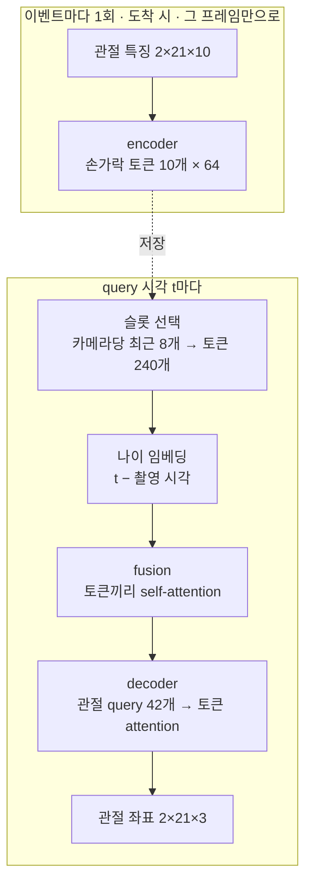

# HandDirect 구조

HandDirect는 비동기로 도착하는 카메라 3대의 2D 손 관절을 받아, 원하는 시각의 두 손 3D 관절 42개를 **신경망만으로 직접** 출력하는 비교용 모델입니다(`--arch direct`; 기본 모델은 HandLiteV3). 삼각측량, anchor, 카메라 보정, 이상치 필터 같은 기하 규칙이 없습니다. 여러 카메라를 합치는 법과 시간에 따른 움직임은 모두 학습으로 배웁니다.

- 코드: [`hand_tracking/direct.py`](../hand_tracking/direct.py), 공통 부품 [`layers.py`](../hand_tracking/layers.py), 설정 `DirectConfig`([`config.py`](../hand_tracking/config.py))
- 두 모델 비교와 학습·배포 명령: [MODELS.md](MODELS.md)
- 기본 모델: [HANDLITEV3_ARCHITECTURE.md](HANDLITEV3_ARCHITECTURE.md)

## 0. 전체 흐름

신경망은 둘입니다. 이벤트마다 도는 **encoder**, query마다 도는 **query 신경망**(fusion + decoder)입니다. 그 사이는 슬롯을 고르는 규칙 하나뿐입니다.

## 1. 입력

**이벤트**는 카메라 한 대의 프레임 하나입니다: 관절 특징 `[2손, 21관절, 14채널]`, 검출 여부 `[2,21]`, 카메라 번호, 촬영·도착 시각(초).

encoder가 쓰는 관절당 특징 10개(`direct_features`):

| 특징 | 개수 | 출처 |
|---|---|---|
| u,v를 −1~1로 옮긴 값 | 2 | 채널 0–1 |
| ray 원점 (카메라 중심, 월드) | 3 | 채널 2–4 |
| ray 방향 (월드) | 3 | 채널 5–7 |
| 촬영→도착 지연 (0.1초 단위) | 1 | 채널 10 |
| 검출 여부 | 1 | valid |

- 검출되지 않은 관절의 특징은 모두 0입니다.
- ray는 2D 관절을 카메라 내부 파라미터와 **정해 둔 배치**로 바꾼 것입니다. 지금은 시뮬레이터가 계산해 넣습니다.
- 같은 카메라에서 더 옛 촬영 프레임이 늦게 도착하면 버립니다(`events.accepted_captures`).

## 2. 이벤트 단계: encoder (8,192 파라미터)

`layers.EventEncoder`, 이벤트당 한 번 계산해 저장하고 다시 계산하지 않습니다.

1. 손마다 관절 21개를 손가락 그룹 5개로 나눕니다. 그룹 = 손목 + 그 손가락 관절 4개 = 5관절 × 10특징 = 50개 값. 고정 0/1 선택 행렬의 MatMul로 모아 ncnn에서도 Gather 없이 돕니다.
2. 다섯 손가락이 MLP 하나를 공유합니다: 50 → 64 → GELU → 64. 첫 층 뒤에 손가락 임베딩을 더해 손가락마다 다르게 해석합니다.
3. 손 임베딩(2개)과 카메라 임베딩(one-hot → 선형)을 더하고 LayerNorm.
4. 결과: 이벤트당 **토큰 10개 × 64** (손 2 × 손가락 5, 손 우선 순서).

한 이벤트의 토큰은 **그 프레임만으로** 정해집니다. 다른 카메라와의 조합은 query 단계에서 합니다.

## 3. Query 단계 (시각 t마다)

### 3-1. 슬롯 선택 (`events.select_slots`)
- t까지 도착했고 촬영이 t − 0.5초(`event_span_s`) 이후인 이벤트 중 **카메라마다 최근 8개**(`slots_per_camera`).
- 24슬롯 × 토큰 10개 = **토큰 240개**. 프레임 속도와 관계없이 크기가 고정이라 고정 shape 그래프로 내보냅니다.
- 빈 슬롯은 앞쪽에 두고 토큰 0, 유효 0으로 채웁니다.

### 3-2. Fusion (68,064 파라미터)
- 각 토큰에 **나이**(t − 촬영 시각, 0.1초 단위)를 MLP(1 → 16 → 64)로 임베딩해 더합니다. 토큰이 "언제 찍힌 정보인지"를 압니다.
- self-attention 블록(`fusion_blocks`, 기본 2개)으로 토큰끼리 정보를 주고받습니다. 여기서 같은 손가락의 다른 카메라 토큰, 같은 카메라의 이전 토큰이 섞입니다.
- 블록 = pre-norm self-attention(head 4) + FFN(64 → 128 → 64). 빈 슬롯은 attention 점수 −1e4로 가려지고 출력도 0으로 유지됩니다.

### 3-3. Decoder (125,836 파라미터, 손목 분해 + 단계적 보정)
- **query**: 학습된 관절 임베딩 42개(손 2 × 관절 21).
- **key/value**: fusion을 거친 토큰 240개 + null 토큰 1개. 슬롯이 하나도 없으면 null 토큰만 봅니다.
- 블록 2개(`blocks`), 각 블록은 cross-attention(관절 → 토큰), self-attention(관절끼리), FFN 순입니다. pre-norm, head 4.
- **손목 기준 분해**(`wrist_relative`, 기본 켬): 손목 head가 두 손목의 절대 좌표를, 관절 head가 나머지 20관절의 **손목 기준 상대 좌표**를 냅니다. 손 위치(수십 cm)와 손 모양(mm~cm)이 한 출력 스케일을 나눠 쓰지 않게 합니다. 두 head는 모든 토큰에 돌고 상수 마스크로 고른 뒤, 상수 행렬곱으로 절대 좌표로 합칩니다(ncnn에 Gather 없음).
- **단계적 보정**(`refine`, 기본 켬): 블록마다 pose를 냅니다. 두 번째 블록부터는 이전 pose를 임베딩(0 초기화)해 토큰에 더하고, 그 블록의 head(0 초기화)는 보정값만 냅니다. 중간 단계 pose(`ModelOutput.stages`)에도 손실을 겁니다(`--stage-weight`, 기본 0.5).
- 두 옵션을 모두 끄면 예전 HandDirect(head 하나, 좌표 직접 출력)와 같고 파라미터 이름도 같습니다. 두 필드가 없는 예전 체크포인트는 끈 상태로 불러옵니다(`config.LEGACY_OPTIONS`).
- 출력: 관절마다 **3D 좌표**(절대 좌표). 내보낸 그래프는 최종 pose만 냅니다.

## 4. 출력

- `pose [2,21,3]`: 정답 좌표계(기본 rig)의 절대 좌표, 월드 단위(현재 데이터 1 단위 = 40cm).
- 카메라 보정값은 없습니다(`ModelOutput.calibration = None`).
- 추가 후처리(평활 등)는 없습니다.

## 5. 학습

- **데이터**: 연속 query 16개와 그 앞 `context_s`(0.75초) 동안의 이벤트로 된 윈도. `--train-queries 4`면 학습은 마지막 query 4개만 씁니다.
- **증강 없음**: 카메라 배치가 고정이므로 그 배치의 월드 좌표를 그대로 배웁니다.
- **정답 좌표계**: rig(카메라 영상으로 알 수 없는 rig 전체 어긋남을 뺀 좌표). 참 월드 좌표 손실을 0.1배로 더합니다.
- **손실**: 관절 위치 SmoothL1(β = 6mm) + 0.1 × 뼈 길이 오차.
- **설정**: 기본값은 HandLiteV3와 같은 TPU 설정(85 epoch, 배치 128, lr 8.5e-4, `--train-queries 4`)입니다. 이전 GPU 실행은 60 epoch, 배치 64, lr 6e-4를 썼습니다. AdamW, cosine, gradient clip 1, CUDA에서 mixed precision.
- 처음부터 좌표를 배우므로 초반 오차가 큽니다. CPU 150배치 뒤 학습 오차 약 122mm(누적 평균)입니다.

## 6. 배포

`python -m training.export`가 신경망 두 개를 ncnn으로 내보냅니다(pnnx 변환, `hand_tracking/direct_export.py`).

| 그래프 | 입력 | 출력 |
|---|---|---|
| `encoder` | 특징 [2, 210], 카메라 one-hot [3] | 토큰 [10, 64] |
| `query` | 토큰 [240, 64], 유효 [240], 나이 [240] | 관절 [42, 3] |

NumPy 런타임(`hand_tracking/direct_runtime.py`)은 이벤트가 오면 encoder를 한 번 돌려 토큰을 저장하고, query 때 슬롯을 골라 query 그래프를 돌립니다. 배치 `forward()`, `DirectStream`, 런타임(ncnn)이 같은 값을 내는 것을 테스트로 확인했습니다. C++ 런타임은 아직 없습니다.

## 7. 수치 요약

| 항목 | 값 |
|---|---|
| 파라미터 | 202,092 (encoder 8,192 · fusion 68,064 · decoder 125,836) |
| 폭 / head / fusion 블록 / decoder 블록 | 64 / 4 / 2 / 2 |
| query당 입력 | 토큰 240 × 64 |
| attention 크기 | fusion 240 × 240, decoder 블록당 42 × 241 |
| 필요 이력 | 0.75초 |
| CPU 학습 처리량 (i7-1260P, 4스레드, 배치 64) | 초당 약 54윈도 |

## 8. 용량 판단 (2026-09-24)

같은 조건(증강 없음, 배치 64, query 4, lr 6e-4, seed 42)으로 CPU 150배치를 비교했습니다.

| 설정 | 파라미터 | 누적 학습 오차 (50 / 100 / 150배치) |
|---|---|---|
| fusion 1 (이전 기본) | 150,755 | 138.3 / 128.7 / 122.4 mm |
| fusion 3블록 | 217,699 | 138.3 / 129.3 / 123.3 mm |
| 폭 128 | 약 4배 | 연산이 약 4배라 실시간 목표와 맞지 않아 제외 |

- fusion을 깊게 해도 초반 학습은 같습니다. 지금은 모델 용량이 학습을 막고 있지 않습니다.
- 손가락 토큰(50개 값 → 64차원)과 query당 토큰 240개는 병목이 아닙니다.
- **확장 기준**: 본학습에서 train과 val 오차가 **둘 다 높은 값에서 함께 멈추면** 용량 부족입니다. 그때 fusion 블록이나 decoder 블록을 먼저 늘립니다(폭보다 연산 증가가 작음). train이 val보다 훨씬 낮으면 용량이 아니라 데이터·정규화 문제입니다.
- **변경 (2026-09-24)**: fusion 1 본학습에서 6 epoch까지 train과 val이 비슷하게 붙어 내려가(42.5 / 41.9mm) 기본을 fusion 2로 올렸습니다. 여러 시점을 합치는 일을 fusion만 맡기 때문입니다. query 연산은 약 1.6배(추정)이며 파이 지연은 아직 재지 않았습니다.

## 9. 알려진 한계

- **본학습 결과**: HandDirect-wrist(손목 분해 + 단계적 보정, fusion 2)가 GPU 60 epoch에 best val 22.8mm입니다(노트북 `gigahands_colab_wrist_refine.ipynb`, 시야 밖 손 포함). 같은 검증 창·관절에서 HandLiteV3(85 epoch, 20.4mm)보다 짧은 클립은 약 2.3mm 뒤지고, 창 300개 이상 장편 클립에서는 0.7mm 차이입니다. 이전 fusion 1 GPU 실행은 6 epoch에 41.9mm였습니다.
- **카메라 1대만 보는 손**: 데이터의 약 16%입니다. 깊이 정보가 약해서 신경망이 이 경우를 얼마나 배우는지가 관건입니다.
- **rig 전체 어긋남**: 대충 놓은 배치의 전체 회전·이동·크기 차이는 알 수 없어, 출력은 "정해 둔 배치 기준" 좌표입니다.
- **실시간 연결 없음**: 실제 카메라(MediaPipe) 입력을 이 특징으로 바꾸는 단계와 C++ 런타임이 아직 없습니다.
