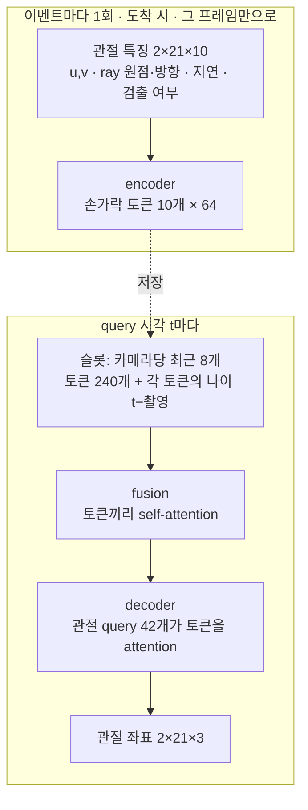

# 두 손 3D 포즈 모델

비동기로 도착하는 카메라 3대의 2D 손 관절(이벤트)을 받아, 원하는 시각의 두 손 3D 관절 42개를 출력합니다. 모델은 두 가지입니다.

| | **HandDirect** (`--arch direct`, 기본) | HandLite (`--arch lite`, 비교용) |
|---|---|---|
| 방식 | 신경망만으로 좌표를 **직접** 출력 | 삼각측량 anchor를 신경망이 보정 |
| 기하 계산 | 없음 | 삼각측량, 직선 외삽, 단일 ray anchor, 카메라 보정, 이상치 필터 |
| 신경망 | encoder, query(fusion + decoder) 2개 | encoder, calibrator, decoder 3개 |
| 파라미터 (폭 64) | 184,227 | 178,637 |
| 필요 이력 | 0.75초 | 1.45초 |
| 런타임 | `direct_runtime.py` (NumPy) | `lite_runtime.py` (NumPy), `cpp/hand_lite` (C++) |
| 자세한 구조 | [HANDDIRECT_ARCHITECTURE.md](HANDDIRECT_ARCHITECTURE.md) | [HANDLITE_ARCHITECTURE.md](HANDLITE_ARCHITECTURE.md) |

HandDirect는 구조를 단순하게 두고 모든 것을 학습으로 해결하는 모델입니다. HandLite는 기하 규칙 덕분에 학습 초반부터 정확하지만 규칙이 많습니다. 같은 데이터·학습량으로 비교한 결과는 아직 없습니다.

## 공통: 입력과 데이터

- **이벤트** = 카메라 한 대의 프레임 하나. 관절 특징 `[2손, 21관절, 14채널]`, 검출 여부 `[2,21]`, 카메라 번호, 촬영·도착 시각(초)입니다. 채널: u,v(0–1) 0–1, ray 원점 2–4, ray 방향 5–7, 촬영→도착 지연 10. 나머지 채널은 모델이 쓰지 않습니다.
- ray는 2D 관절을 카메라 내부 파라미터와 **정해 둔 배치(공칭 외부 파라미터)**로 바꾼 것입니다. 지금은 시뮬레이터가 계산해 NPZ에 넣습니다. 실제 카메라(MediaPipe)와의 연결은 아직 없습니다.
- 같은 카메라에서 더 옛 촬영 프레임이 늦게 도착하면 버립니다(`events.accepted_captures`).
- **슬롯**: query 시각 t까지 도착했고 촬영이 t − 0.5초 이후인 이벤트 중 카메라마다 최근 8개(`events.select_slots`). 프레임 속도와 관계없이 입력 크기가 고정됩니다.
- **학습 윈도**(`data.make_sample`): 연속 query 16개와, 첫 query보다 `context_s` 전부터 마지막 query까지 도착한 이벤트(최대 128개, 배치마다 실제 개수로 잘라 씀). 시각은 마지막 query 기준 상대 초입니다. `--train-queries N`이면 학습은 윈도의 마지막 N개 query만 씁니다(검증은 전부).
- **증강 없음**: 카메라 배치가 고정이므로, 그 배치의 월드 좌표를 모델이 그대로 배우는 편이 유리합니다. 배치의 작은 흔들림(설치 오차)은 데이터 생성기가 클립마다 따로 넣습니다.
- **정답 좌표계**(`--target-frame`, 기본 `rig`): 카메라 영상으로는 카메라끼리의 상대 배치만 알 수 있고, 세 대가 함께 돌거나 밀리거나 크기가 다른 어긋남은 알 수 없습니다. 그래서 클립마다 "정해 둔 배치를 실제로 놓인 대로" 본 좌표계로 정답을 옮깁니다(`data.rig_frame`). 원점은 정해 둔 배치의 기준점 그대로라 손이 그 주변 어디서 움직이는지는 배웁니다. 참 월드 좌표 정답(`target_world`)도 `--world-weight`(기본 0.1)만큼 손실에 더합니다.
- 참가자·원본 클립이 split 사이에 겹치지 않는지 시작할 때 검사합니다.

## HandDirect 구조



- **encoder** (8,192 파라미터, `layers.EventEncoder`): 손마다 손가락 그룹 5개(손목 + 손가락 관절 4개 = 50특징)를 MLP 하나(50 → 64 → 64)로 토큰으로 만들고, 손가락·손·카메라 임베딩을 더합니다. 이벤트당 토큰 10개이며, **다른 카메라 프레임과 무관**하게 한 번만 계산해 저장합니다.
- **fusion** (68,064): 토큰마다 나이(촬영~t, 0.1초 단위)를 MLP로 임베딩해 더한 뒤, self-attention 블록(기본 2개)으로 카메라·시각 사이에 정보를 주고받습니다. 빈 슬롯은 0이고 attention에서 가려집니다.
- **decoder** (107,971): 학습된 관절 query 42개가 cross-attention(토큰) → self-attention(관절끼리) → FFN 블록(기본 2개)을 거쳐 좌표 3개씩을 냅니다. 슬롯이 하나도 없으면 null 토큰만 봅니다.
- 삼각측량·보정·anchor가 없으므로 여러 시점을 합치는 법과 시간에 따른 움직임은 모두 학습으로 배웁니다. 출력은 정답 좌표계(rig)의 절대 좌표입니다.
- 배치 `forward()`와 이벤트별 `DirectStream`, NumPy `DirectRuntime`(ONNX Runtime·ncnn)이 같은 값을 냅니다(테스트로 검증).

## 학습

```powershell
.\.venv-transformer\Scripts\python.exe -m training.train --arch direct --data exports/gigahands_pi3_overlap --output runs/hand_direct
```

- 기본값이 권장 설정입니다: 60 epoch, 배치 64, `--train-queries 4`, lr 6e-4, HandDirect fusion 2블록. Colab 노트북도 같은 값을 씁니다.

- Colab은 [gigahands_colab.ipynb](../notebooks/gigahands_colab.ipynb)를 씁니다(`ARCH='direct'` 기본). 모델 코드를 바꾼 뒤에는 `python -m training.build_colab_notebook --dataset <데이터셋>`으로 다시 만듭니다. 소스가 바뀌면 이전 실행은 재개되지 않으니 새 실행 이름을 쓰세요.
- 손실: 모든(학습) query의 관절 위치 SmoothL1(미터 단위, β=6mm) + 0.1 × 뼈 길이 L1, 여기에 참 월드 좌표 손실 × `--world-weight`. HandLite는 카메라 보정 보조 손실(`--calibration-weight`)이 더해집니다.
- 최적화: AdamW(weight decay 0.01), cosine LR, gradient clipping 1.0. CUDA에서는 mixed precision을 쓰고, fp16 오버플로 스텝은 건너뜁니다(50번 연속이면 멈춤, `skipped_steps` 기록).
- 모델 설정의 모든 필드가 같은 이름의 옵션입니다(`--dim`, `--fusion-blocks`, `--blocks`, `--slots-per-camera`, `--event-span-s` 등, 목록은 `--help`). `--compile`은 신경망을 `torch.compile`로 감쌉니다(체크포인트 호환, 미검증).
- 한 epoch은 클립마다 무작위 윈도 최대 16개(`--windows-per-clip`)이고, 검증은 클립마다 고정 윈도 16개입니다.
- query 시각 전 `event_span_s`(0.5초) 안에 어느 카메라도 검출하지 못한 손은 정답에서 뺍니다(`target_mask` 끔, 검증 데이터 약 0.9%). 입력에 흔적이 없어 추정할 근거가 없기 때문입니다. 학습·검증·`training.evaluate`에 모두 적용되므로, 이 규칙 이전 실행의 val 값과는 직접 비교할 수 없습니다. 모델에 손 존재 출력은 아직 없습니다.
- 데이터 준비(NPZ 압축 해제, rig 좌표계 계산)가 GPU보다 느려 학습 속도를 정합니다. `--cache-dir <폴더>`를 주면 첫 epoch에 전처리한 클립을 압축 없이 저장하고(데이터의 약 2배 용량) 이후 epoch은 그것을 읽습니다. 원본 NPZ가 바뀐 클립은 다시 만듭니다. Colab 노트북은 `/content/gigahands_cache`를 씁니다.
- `best.pt`는 검증 MPJPE가 가장 낮은 epoch, `last.pt`는 마지막 완료 epoch입니다. 설정은 `run.json`, 지표는 `metrics.jsonl`에 저장합니다. 같은 명령에 `--resume`을 붙이면 마지막 완료 epoch부터 이어갑니다(설정·manifest가 같아야 함. 속도 설정 `--workers`, `--threads`, `--cache-dir`는 달라도 됨).

## 평가·추론·배포

```powershell
.\.venv-transformer\Scripts\python.exe -m training.evaluate --checkpoint runs/hand_direct/best.pt --data exports/gigahands_pi3_overlap --output runs/hand_direct/val.json
.\.venv-transformer\Scripts\python.exe -m training.evaluate --triangulation-only --data exports/gigahands_pi3_overlap --output runs/anchor_baseline.json
.\.venv-transformer\Scripts\python.exe -m training.predict --checkpoint runs/hand_direct/best.pt --input exports/gigahands_pi3_overlap/val/<clip>.npz --output runs/hand_direct/prediction.npz
.\.venv-transformer\Scripts\python.exe -m training.export --checkpoint runs/hand_direct/best.pt --output runs/hand_direct/deploy --check-input exports/gigahands_pi3_overlap/val/<clip>.npz
```

- 지표: 윈도 **마지막 query**의 MPJPE(mm)와 PCK@20mm(정답 좌표계), 참 월드 좌표 MPJPE(`mpjpe_world_mm`).
- `--triangulation-only`는 학습 없는 기하 기준선입니다: HandLite의 anchor(보정 없음, 신경망 보정 0).
- `training.export`는 체크포인트의 모델에 맞춰 신경망을 ONNX·ncnn으로 내보내고, 검증 클립에서 NumPy 런타임과 PyTorch 스트림의 차이를 확인합니다(`--tolerance` 기본 2e-3, ncnn fp16 고려). 결과 폴더를 장치로 복사하면 `numpy`와 `ncnn`(또는 `onnxruntime`)만으로 추론합니다.

```python
from hand_tracking.direct_runtime import DirectRuntime
runtime = DirectRuntime('deploy', backend='ncnn')                    # 또는 'onnxruntime'
runtime.push(camera, features, valid, capture_time, arrival_time)   # 카메라 프레임 도착마다
pose = runtime.query(time)                                          # [2,21,3] 월드 단위
```

## 코드 구성 (`hand_tracking/`)

| 모듈 | 내용 |
|---|---|
| `constants.py`, `config.py`, `contracts.py` | 입력 채널·단위, 모델 설정(`DirectConfig`, `LiteConfig`), 텐서 계약 |
| `data.py` | NPZ에서 이벤트 복원, 학습 윈도, rig 좌표계 |
| `events.py` | 이벤트 수락, 슬롯 선택, (HandLite) 최신 ray·삼각측량 표본·anchor |
| `geometry.py` | (HandLite) 삼각측량, 이상치 ray 제거, 카메라 보정 적용 |
| `layers.py` | 공통 신경망 부품: attention, 블록, 손가락 토큰 encoder |
| `direct.py`, `direct_export.py`, `direct_runtime.py` | HandDirect 모델·스트림, 내보내기, NumPy 런타임 |
| `lite.py`, `lite_export.py`, `lite_runtime.py` | HandLite 모델·스트림, 내보내기, NumPy 런타임 |
| `stream.py` | 이벤트별 스트리밍 공통 부분(순서 검사, 오래된 이벤트 정리, 인코딩 캐시) |
| `objectives.py`, `engine.py`, `checkpoints.py` | 손실·지표, 학습/검증 루프, 체크포인트 |

실행 명령은 `training/`(`train`, `evaluate`, `predict`, `export`, `build_colab_notebook`)에 있고, 저장소 루트에서 `python -m training.<이름>`으로 실행합니다. 테스트는 `python -m unittest discover -s tests`입니다.

## 상태

- HandDirect는 처음부터 좌표를 배우므로 학습 초반에는 기하 기준선보다 나쁩니다(예: CPU 20배치 후 val 약 128mm). 본학습 결과는 아직 없습니다.
- CPU(i7-1260P, 4스레드) 학습 처리량: HandDirect 초당 약 54윈도, HandLite 약 38윈도(배치 64, 학습 query 4개).
- HandDirect의 C++ 런타임은 아직 없습니다(HandLite만 있음).
- 실제 카메라에 쓰기 전에는 실제 3카메라 관측에서 손 좌우 대응, 관절 오차, 지연 분포를 따로 확인해야 합니다.
