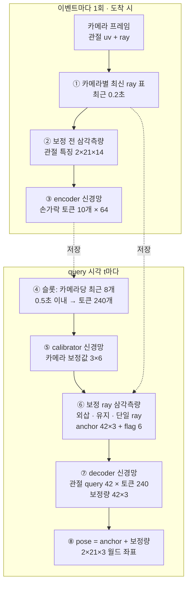

# HandLite 전체 구조 — 전처리·모델·후처리

> **보관용 (2026-09-28):** HandLite v1은 HandLiteV3로 대체되어 Python 코드와 C++ 런타임(`cpp/hand_lite`)이 모두 삭제됐습니다. 설계 기록으로만 남깁니다. 아래의 파일 경로·명령은 더 이상 동작하지 않습니다. 현재 모델은 [../MODELS.md](../MODELS.md), 전체 개발 이력은 [HISTORY.md](HISTORY.md)를 보세요.

> 비교용 모델입니다. 기본 모델(HandDirect)과 두 모델의 비교는 [MODELS.md](MODELS.md)를 보세요.

HandLite는 **기하 계산으로 대략적인 3D 위치(anchor)를 구하고, 작은 신경망이 그 오차만 보정하는** 모델입니다. 비동기로 들어오는 카메라 3대의 2D 손 관절을 받아, 원하는 시각의 두 손 3D 관절 42개를 출력합니다.

이 문서는 현재 기본 설정 기준입니다(손가락 토큰·간격 임베딩·ray 깊이 anchor 켜짐, 이상치 필터 꺼짐). 설정값은 [`hand_tracking/config.py`](../hand_tracking/config.py)의 `LiteConfig`에 있습니다.

## 0. 전체 흐름



- 신경망은 ③ encoder, ⑤ calibrator, ⑦ decoder 세 개뿐이고, 나머지는 학습 파라미터가 없는 기하 계산입니다.
- 배포할 때는 세 신경망을 고정 shape의 ONNX·ncnn 그래프로 내보내고, 기하 계산은 NumPy([`lite_runtime.py`](../hand_tracking/lite_runtime.py))나 C++([`cpp/hand_lite`](../cpp/hand_lite/README.md))가 맡습니다.

| 단계 | 코드 |
|---|---|
| 데이터 준비 | [`hand_tracking/data.py`](../hand_tracking/data.py) |
| 이벤트 정리·삼각측량·anchor | [`hand_tracking/events.py`](../hand_tracking/events.py), [`hand_tracking/geometry.py`](../hand_tracking/geometry.py) |
| 신경망·배치 실행·스트림 | [`hand_tracking/lite.py`](../hand_tracking/lite.py) |
| 내보내기 | [`hand_tracking/lite_export.py`](../hand_tracking/lite_export.py), [`training/export.py`](../training/export.py) |
| 손실·학습 | [`hand_tracking/objectives.py`](../hand_tracking/objectives.py), [`hand_tracking/engine.py`](../hand_tracking/engine.py), [`training/train.py`](../training/train.py) |

## 1. 입력 (전처리 A: 카메라 → 이벤트)

**이벤트**는 카메라 한 대의 프레임 하나입니다.

| 항목 | 형태 | 내용 |
|---|---|---|
| 관절 특징 | [2손, 21관절, 14채널] | 아래 채널 표 |
| 검출 여부 | [2, 21] | 관절마다 검출됐는지 |
| 카메라 번호 | 0~2 | |
| 촬영 시각, 도착 시각 | 초 | 서로 다름(전송 지연). 카메라끼리 동기화되지 않음 |

| 채널 | 의미 | 모델 사용 |
|---|---|---|
| 0–1 | 정규화 픽셀 좌표 u,v (0~1) | O |
| 2–4 | ray 원점 = 카메라 중심 (기본 캘리브레이션, 월드 좌표) | O |
| 5–7 | ray 방향 (월드 축) | O |
| 10 | 촬영→도착 지연 (초) | O |
| 8–9, 11–13 | 내보내기 시점 기준 시각, ID | X |

- 2D 관절을 3D ray로 바꾸려면 카메라 내부·외부 파라미터가 필요합니다. 지금은 **시뮬레이터가 이 변환까지 해서 NPZ로 저장**합니다.
- 실시간 MediaPipe 수신기(`camera/`)와는 아직 연결되지 않았습니다. 실제 카메라를 쓰려면 MediaPipe 2D 관절을 이 14채널로 바꾸는 단계가 필요합니다.
- 손 관절 순서는 손목 0, 엄지 1–4, 검지 5–8, 중지 9–12, 약지 13–16, 소지 17–20입니다.
- 손 0/1이 왼손/오른손이라는 보장은 없습니다. 시뮬레이터의 원본 순서를 따릅니다.

## 2. 학습 데이터 준비 (전처리 B)

1. **이벤트 복원** (`clip_events`): NPZ는 query 격자 형식입니다. 각 query에 카메라별로 선택된 프레임이 기록되어 있어서, 처음 선택된 시점의 프레임을 이벤트로 복원하고 도착 순서로 정렬합니다. 검출이 하나도 없는 프레임도 이벤트로 남습니다. 두 query 사이에 덮어쓰인 프레임은 이 형식에서 복원할 수 없습니다.
2. **윈도 자르기** (`make_sample`)
   - 연속한 query 16개를 잡습니다.
   - 첫 query보다 `context_s`(1.45초) 전부터 마지막 query까지 도착한 이벤트를 모읍니다. 최대 128개이고, 넘치면 오래된 것부터 버립니다.
   - 모든 시각은 **마지막 query 기준 상대 초**(float32)로 바꿉니다.
   - 검출되지 않은 관절의 특징은 0으로 둡니다.
3. **증강 없음**: 카메라 배치가 고정이라 그 배치의 월드 좌표를 그대로 배우게 합니다.
4. **정답**
   - query 시각의 3D 관절 `target [16,2,21,3]`과 마스크. 기본은 **rig 좌표계**입니다(아래).
   - 참 월드 좌표 정답 `target_world [16,2,21,3]`: 약한 보조 손실과 평가용입니다.
   - 카메라 보정 정답 `calibration_target [3,6]`: 시뮬레이터가 넣은 설치 오차를 정답 좌표계로 표현한 값입니다. 모델 입력이 아니며, 보조 손실에만 씁니다.
5. **정답 좌표계(`--target-frame`, 기본 `rig`)**: 카메라 영상은 카메라끼리의 상대 배치만 알려 줍니다. 세 대를 통째로 돌리거나 옮기거나 크기를 바꾼 오차(7자유도)는 어떤 방법으로도 관측할 수 없습니다. 그래서 정답을 클립마다 "정해 둔 배치를 실제로 놓인 대로" 본 좌표계로 옮깁니다. 카메라별 보정량(회전 5°, 위치 0.1 단위 기준)이 가장 작아지는 유사변환(회전·이동·크기)을 구해 정답 3D와 보정 정답에 적용합니다(`data.rig_frame`). 모델 입력은 그대로입니다. 원점은 여전히 정해 둔 배치의 기준점이라 손이 그 주변 어디서 움직이는지는 그대로 배웁니다. 빠지는 것은 클립마다 무작위인 rig 전체 어긋남뿐입니다. 참 월드 좌표 정답(`target_world`)도 `--world-weight`(기본 0.1)만큼 손실에 더해 월드 좌표 쪽으로도 약하게 끌어당깁니다. 평가는 두 좌표계의 MPJPE(`mpjpe_mm`, `mpjpe_world_mm`)를 모두 기록합니다. 검증 12클립의 자기 보정 기준선은 rig 29.0mm, world 43.3mm였습니다(PCK@20mm 0.58 대 0.18). 이 옵션 이전 체크포인트는 `world`로 학습된 것으로 보고 평가합니다. 시뮬레이터 rig 정보가 없는 실측 클립은 두 좌표계가 같습니다.

## 3. 이벤트 단계 (도착 시 1회, 결과 저장)

1. **입력 정리** (`make_events`): 같은 카메라에서 더 옛 촬영 프레임이 늦게 도착하면 버립니다. 14채널 중 모델이 쓰는 11채널만 남깁니다.
2. **최신 ray 표**: 이벤트가 도착한 순간, 카메라 3대 각각의 가장 최근 프레임 ray를 모읍니다(`sample_max_age_s` 0.2초 이내). 카메라마다 서로 다른 시각에 찍은 ray가 섞입니다.
3. **보정 전 삼각측량**: 관절마다 두 대 이상이 보면 최소제곱으로 3D 점을 구합니다.
   - ray가 거의 평행하면(sin² < 2e-3, 약 2.6°) 버리고, 점이 카메라 뒤에 있어도 버립니다.
   - 결과(점, 성공 여부, 사용한 ray의 평균 촬영 시각)를 저장해 뒤의 단일 ray anchor에서 기억 기준점으로 씁니다.
4. **관절 특징 14개** (`joint_features`)
   - u,v를 −1~1로 옮긴 값 (2)
   - ray 원점 (3), ray 방향 (3)
   - 지연을 0.1초 단위로 바꾼 값 (1)
   - miss 벡터: ray에서 삼각측량 점까지의 수직 벡터 × 10 (3)
   - 검출 여부 (1), 삼각측량 성공 여부 (1)
5. **Encoder 신경망** (9,472 파라미터)
   - 손마다 손가락 그룹 5개(손목 + 손가락 관절 4개 = 70특징)로 나눕니다. 그룹은 고정 0/1 선택 행렬의 MatMul로 모아, ncnn에서 Gather 없이 동작합니다.
   - 다섯 손가락이 MLP 하나를 공유합니다(70 → 64 → GELU → 64). 첫 층 뒤에 손가락 임베딩을 더해 손가락마다 다르게 해석합니다.
   - 손 임베딩과 카메라(one-hot → 선형) 임베딩을 더하고 LayerNorm을 거칩니다.
   - 이벤트당 **토큰 10개**(2손 × 5손가락)를 만들어 저장하고, 이후에는 다시 계산하지 않습니다.

## 4. Query 단계 (시각 t마다)

### 4-1. 슬롯 선택
- t까지 도착했고 촬영이 t − 0.5초(`event_span_s`) 이후인 이벤트 중, **카메라마다 최근 8개**(`slots_per_camera`)를 고릅니다.
- 24슬롯 × 토큰 10개 = **토큰 240개**입니다. 입력 크기가 항상 같아서 고정 shape 그래프로 내보낼 수 있습니다.
- 빈 슬롯은 앞쪽에 두고, 토큰 0·간격 0·완전 마스크로 채웁니다.

### 4-2. Calibrator 신경망 (55,174 파라미터)
- 카메라마다 학습된 query 1개가 그 카메라의 토큰만 attention으로 모읍니다(null key 포함).
- self-attention 블록 1개와 MLP를 거쳐 카메라별 **보정값 6개**(회전 벡터 3, 위치 이동 3)를 냅니다.
- 출력은 회전 5°, 위치 0.1 단위 규모로 조정됩니다. 출력층을 0으로 초기화해 학습 시작 시 보정이 없습니다.
- 슬롯 안에 다른 카메라와 삼각측량된 증거가 없는 카메라는 보정 0으로 둡니다.

### 4-3. 보정 후 삼각측량
- 삼각측량은 두 번 합니다. 1차(3절 3번)는 이벤트 도착 시 공칭 ray로 하고, 그 결과는 encoder 특징과 기억 기준점에만 씁니다. 여기서는 2차로, 각 슬롯 이벤트에 저장해 둔 ray 표(도착 순간의 카메라별 최신 ray)에 calibrator 보정값을 적용해 삼각측량합니다. anchor는 이 2차 결과로 만듭니다.
- 두 번인 이유: calibrator가 보정값을 내려면 encoder 토큰이 필요하고, 토큰에는 1차 삼각측량 결과(miss 벡터 등)가 들어가므로 1차는 보정 없이 할 수밖에 없습니다. 보정값은 query마다 새로 추정되므로 2차도 query마다 합니다.
- **이상치 ray 제거** (`ray_outlier_ratio`, 기본 0 = 끔)
  - 한 ray를 빼고 나머지 두 ray로 점을 구해, 빠진 ray의 각도 잔차가 나머지 잔차(최소 0.01 rad)의 몇 배인지 봅니다.
  - 그 비율이 기준(권장 시험값 6)을 넘고 다음 후보보다 3배 이상 두드러지면 그 ray만 버립니다.
  - 후보가 비슷하게 둘이면 모호하므로 표본을 버립니다.
  - 기본으로 꺼 둔 이유: 캘리브레이션이 틀린 카메라가 이상치와 똑같이 보여, calibrator가 덜 학습된 상태에서는 오히려 나빠집니다. 깨끗한 검증 윈도의 anchor MPJPE가 보정 없이 55.6 → 68.9mm, 참 보정값으로 11.24 → 11.44mm였습니다.

### 4-4. Anchor (신경망 없는 규칙, `query_anchor`)
관절마다 다음 순서로 적용합니다.

| 순서 | 규칙 | 조건 |
|---|---|---|
| 1 | **직선 외삽**: 최근 표본에 직선을 맞춰 t로 외삽 | 0.2초(`anchor_lookback_s`) 안의 서로 다른 표본 2개 이상, 시간 분산 충분. 최대 0.25초 외삽 |
| 2 | **유지**: 마지막 표본을 그대로 사용 | 0.3초(`anchor_hold_s`) 이내 표본 |
| 3 | **단일 ray**: 기준점을 가장 잘 맞는 ray 위에 기준점 깊이로 놓음 | 최신 이벤트에서 삼각측량 실패(두 대 미만 또는 모호), ray와 기준점이 있을 때 |
| 4 | **손 평균** | 관절 anchor가 없을 때 같은 손 평균, 손 전체가 없으면 원점 |

- 같은 표본이 여러 이벤트에 반복되면(한 카메라만 새로 찍힌 경우) 직선 맞춤에서 한 번만 셉니다.
- 단일 ray의 기준점은 기존 anchor → 1초(`anchor_depth_memory_s`) 안의 마지막 삼각측량 → 같은 손 평균 순으로 고릅니다. 서로 안 맞는 ray가 여럿이면 기준점과 가장 잘 맞는 ray를 씁니다. 한 카메라가 계속 보는 동안 좌우·상하는 따라가고, 깊이만 기억한 값이 됩니다.
- **flag 6개**: 최신 표본 성공, 관절 anchor 있음, 손 anchor 있음, 나이(0.1초 단위), 외삽 여부, 단일 ray 여부.

### 4-5. Decoder 신경망 (113,991 파라미터)
- **query**: 관절 42개 = 관절 임베딩 + MLP(anchor 좌표 3 + flag 6 → 64).
- **key/value**: 토큰 240개와 null 토큰 1개.
  - **간격 임베딩**: 촬영~t 간격을 MLP(1 → 16 → 64)로 바꿔 토큰 값에 더합니다. 토큰이 자기 나이를 알고 해석됩니다.
  - **시간 bias**: 같은 간격을 MLP(1 → 16 → head 수)로 바꿔 attention 점수에 더합니다. 어느 토큰을 볼지를 정합니다.
  - 무효 토큰의 점수는 정확히 −1e4로 고정되어, 시간 bias로도 되살아나지 않습니다.
- **블록 2개**: 각 블록은 cross-attention(관절 → 토큰), self-attention(관절끼리), FFN(64 → 128 → 64) 순입니다. pre-norm, head 4개.
- **출력**: 관절마다 보정량 3개. 출력층을 0으로 초기화해 학습 시작 시 결과가 anchor와 같습니다.

## 5. 후처리

- **pose = anchor + 보정량**을 [2,21,3] 월드 좌표로 냅니다(현재 데이터 1 단위 = 40cm).
- 칼만 필터나 시간 평활 같은 추가 후처리는 없습니다. 시간 처리는 모두 anchor 외삽과 decoder 안에서 일어납니다.
- 부가 출력(`return_details=True`): 그 query에서 쓴 카메라 보정값 [3,6], 슬롯이 하나라도 있었는지 여부.
- **스트림 실행**
  - `LiteStream`(PyTorch), `LiteRuntime`(NumPy + ncnn/ONNX Runtime), C++ `hand_lite::Runtime`이 모두 배치 `forward()`와 같은 값을 냅니다(테스트로 검증).
  - 이벤트는 도착 순서대로 `push`하고, 최신 도착 이후의 아무 시각에나 `query`할 수 있습니다.
  - 저장된 이벤트는 `context_s + 0.5초`보다 오래되면 지웁니다.

## 6. 학습

- **pose 손실**: 모든 query의 관절 위치 SmoothL1(미터 단위, β = 6mm)에 뼈 길이 오차 × 0.1(`--bone-weight`)을 더합니다. rig 좌표 정답 손실에 참 월드 좌표 정답 손실 × 0.1(`--world-weight`)을 더합니다.
- **보정 보조 손실**: calibrator 출력과 보정 정답의 차이를 사전 표준편차(5°, 0.1 단위)로 나눈 제곱 평균 × 0.01(`--calibration-weight`). 정답이 없는 실제 데이터에서는 빠집니다.
- **최적화**: AdamW(lr 3e-4, weight decay 0.01), cosine 스케줄, gradient clip 1, CUDA에서 mixed precision. 기본 30 epoch, batch 16, 클립마다 epoch당 윈도 16개.
- 잔차 head(decoder 출력, calibrator 출력, 간격 임베딩)를 0으로 초기화했으므로, 학습은 기하 기준선에서 시작합니다.

```powershell
.\.venv-transformer\Scripts\python.exe -m training.train --arch lite --data exports/<데이터셋> --output runs/hand_lite
.\.venv-transformer\Scripts\python.exe -m training.export --checkpoint runs/hand_lite/best.pt --output runs/hand_lite/deploy --check-input exports/<데이터셋>/val/<clip>.npz
```

## 7. 수치 요약

| 항목 | 값 |
|---|---|
| 파라미터 | 178,637 (encoder 9,472 · calibrator 55,174 · decoder 113,991) |
| 폭 / head / decoder 블록 | 64 / 4 / 2 |
| query당 신경망 입력 | 토큰 240 × 64, anchor 특징 42 × 9 |
| 필요 이력 | 1.45초, 최대 128 이벤트 |
| 속도 (i7-1260P, 1스레드, NumPy 런타임) | query 약 2.5~3ms, 이벤트 push 약 0.5ms |
| export 형식 | 4 (형식 2·3 export와 옛 체크포인트도 읽음) |

### 설정 옵션 (예전 구조로 되돌리기)

| 옵션 | 기본 | 끄는 학습 플래그 | 옛 체크포인트·export |
|---|---|---|---|
| `finger_tokens` | 켜짐 | `--no-finger-tokens` | 꺼짐으로 읽음 |
| `gap_embedding` | 켜짐 | `--no-gap-embedding` | 꺼짐으로 읽음 |
| `anchor_ray_depth` | 켜짐 | `--no-anchor-ray-depth` | 꺼짐으로 읽음 |
| `ray_outlier_ratio` | 0 (끔) | `--ray-outlier-ratio 6`으로 켬 | 0으로 읽음 |

## 8. 알려진 한계

- **캘리브레이션 의존**: 같은 검증 데이터에서 보정이 없으면 anchor MPJPE가 약 56mm, 참 보정값이면 약 11mm입니다. calibrator 학습 품질이 가장 큰 변수입니다.
- **rig 전체 어긋남은 알 수 없음**: 카메라를 대충 놓으면 출력은 "정해 둔 배치 기준" 좌표입니다. 실제 공간의 절대 좌표가 필요하면 알려진 위치에 손을 한 번 대는 식의 기준점이 필요합니다(아직 구현 안 됨).
- **단일 시점 기억 한계**: 한 카메라만 보는 상태가 1초를 넘으면 기억 기준점이 사라져 anchor가 원점으로 떨어집니다.
- **학습 데이터 부족**: 단일 시점(검증 데이터의 약 1.4%)과 엉뚱한 프레임 상황이 학습 데이터에 거의 없어서, decoder가 이 상황의 보정을 배우기 어렵습니다.
- **이상치 판정의 모호성**: 한 ray가 다른 카메라와의 에피폴라 평면 안에서 어긋나면 기하만으로는 누가 틀렸는지 알 수 없어 표본을 버립니다.
- **실시간 연결 없음**: 실제 카메라 입력 경로가 아직 없습니다(1절 참고).
- **정확도 미확인**: 현재 구조의 정확도는 아직 본학습으로 검증되지 않았습니다.
